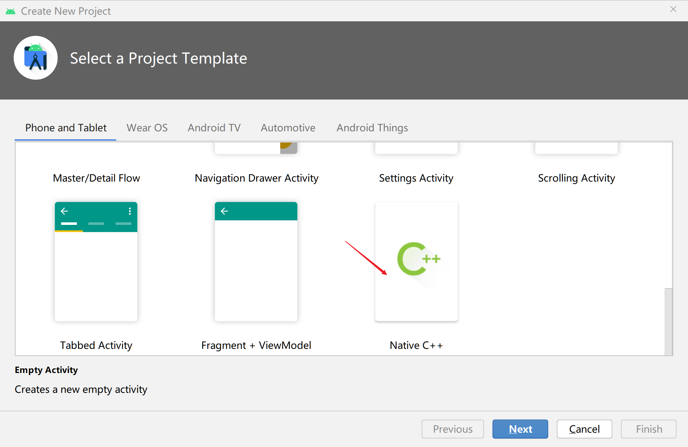
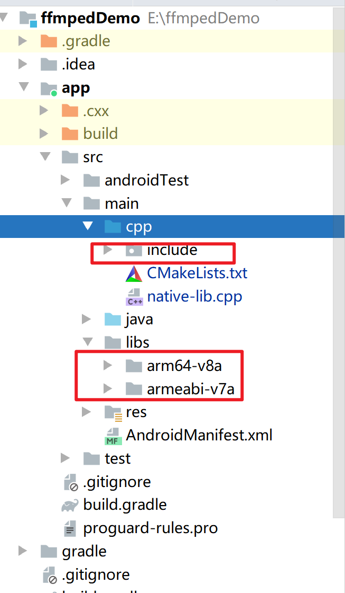
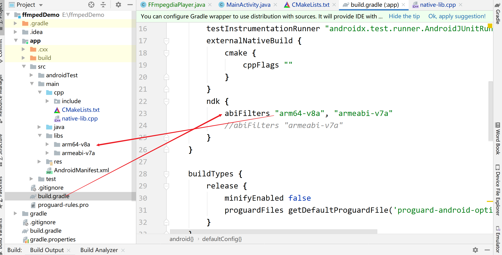

# FFmpeg教程

源码编译等有空在编译，目前没有自己编译，我是github上下载别人的项目，直接拿来使用的。

## FFmpeg在android studio下使用

1.创建一个c++项目



2.添加库，静态库复制到制定目录



支持在平台，自己导入了那些包，就支持那些平臺




配置cMakeKists文件

```
project("ffmpeddemo")
set(CMAKE_CXX_FLAGS "${CMAKE_CXX_FLAGS} -std=gnu++11")
set(libs ${CMAKE_SOURCE_DIR}/../libs)
set(libname play)  #编译之后的名字  不一样要和文件名相同

#编译的文件 在include文件夹下、、、

include_directories(
        include
        play
        utils
        play/decor
        play/decor/base
#        ${CMAKE_SOURCE_DIR}/util
)

link_directories(
        ${libs}/${ANDROID_ABI})

#编译那些文件
file(GLOB src-files
        ${CMAKE_SOURCE_DIR}/*.cpp
        ${CMAKE_SOURCE_DIR}/play/*.cpp
        ${CMAKE_SOURCE_DIR}/play/*.h
        ${CMAKE_SOURCE_DIR}/utils/*.cpp
        ${CMAKE_SOURCE_DIR}/utils/*.h
        ${CMAKE_SOURCE_DIR}/play/decor/*.cpp
        ${CMAKE_SOURCE_DIR}/play/decor/*.h
        ${CMAKE_SOURCE_DIR}/play/decor/base/*.cpp
        ${CMAKE_SOURCE_DIR}/play/decor/base/*.h
        )

//可以立即为导入的包
add_library( # Sets the name of the library.
        ${libname}
        # Sets the library as a shared library.
        SHARED
        # Provides a relative path to your source file(s).
        ${src-files}  #加入的就是上面指定文件下的所有
        )
//第3方库
set(third-party-libs
        avformat
        avcodec
        avfilter
        swresample
        swscale
        avutil
        fdk-aac
        x264
        )
//native 库
set(native-libs
        android
        log
        OpenSLES
        )
//链接哪些库
target_link_libraries( # Specifies the target library.
        ${libname}
        ${log-lib}
        ${third-party-libs}
        ${native-libs}
        android
        z
        OpenSLES
        )
```

配置编译  链接 哪些东西

## 测试环境

```java
extern "C"
JNIEXPORT jstring JNICALL
Java_com_kangwang_ffmpeddemo_FFmpegdiaPlayer_native_1version(JNIEnv *env, jobject thiz) {
    string hello = av_version_info();
    string avutil = to_string(avutil_version());
    hello.append(avutil);
    LOGCATI("avutil");
    return env->NewStringUTF(hello.c_str());
}
```

java层

```
public String versionInfo() {
    return native_version();
}
```

## 视频播放和音频播放

### 通用代码

1,分析一下解析的套路

```java
formatContext = avformat_alloc_context();  //封装上下文
AVDictionary *opts = NULL;//从字典中取值
av_dict_set(&opts, "timeout", "30000000", 0); //如果这么久都没有打开，就认为有问题
int ret = avformat_open_input(&formatContext,m_url,NULL,&opts);//打开文件
if (ret){   //为0表示成功
    LOGCATE("open file failed");
    return;
}else{
    LOGCATE("open file success");
}

avformat_find_stream_info(formatContext,NULL); //读取成功    读取视频流  解析出来

//便利
for(int i= 0; i<formatContext->nb_streams;i++){
    //视频流
    if(formatContext->streams[i]->codecpar->codec_type == AVMEDIA_TYPE_VIDEO){
        video_stream_index = i;
    } else if(formatContext->streams[i]->codecpar->codec_type == AVMEDIA_TYPE_AUDIO){
        audeo_stream_index = i;
    }
}
```

分析：首先创建一个全局上下文，然后读取文件，将流文件写入到全局上下文中。我们限制就需要去遍历流，区分出视频和音频流。这就是上面一段代码的所有内容

它不仅仅是音频是那样写，视频也是一样的。对于视频都需要上面一段共同代码，下来就属于它们自己了。

### 播放方式一   使用nativeWindow方式进行播放 

1.使用nativeWindow方式进行播放

```java
nativeWindow = ANativeWindow_fromSurface(env,surface);
```

